<picture><source media="(prefers-color-scheme: dark)" srcset="./assets/design/hero.dark.svg"></picture>

# Hi, I’m Duke486 👋

> ~~24601♪~~ 雾

**CS 毕业生，喜欢 ACGN 文化，PT 玩家。**

Nyaa(=・ω・=)~ 这里是 Duke486！Meow( · ω · )~ here is Duke486!

[✉ 欢迎来信](mailto:duke_486@outlook.com) · [AniList](https://anilist.co/user/Duke486/) · [Steam](https://steamcommunity.com/profiles/76561198404562076/)

## 01 / Projects

写一点代码，做一点喜欢的东西。

<a href="https://github.com/Duke486/Web-Dev-Beginner"><picture><source media="(prefers-color-scheme: dark)" srcset="./assets/github/Web-Dev-Beginner.dark.svg"></picture></a>
<a href="https://github.com/Duke486/Miku-Skin-ClashVerge"><picture><source media="(prefers-color-scheme: dark)" srcset="./assets/github/Miku-Skin-ClashVerge.dark.svg"></picture></a>
<a href="https://github.com/Duke486/Galgamer_WebPlayer"><picture><source media="(prefers-color-scheme: dark)" srcset="./assets/github/Galgamer_WebPlayer.dark.svg"></picture></a>
<a href="https://github.com/Duke486/Fluent-Toys"><picture><source media="(prefers-color-scheme: dark)" srcset="./assets/github/Fluent-Toys.dark.svg"></picture></a>

项目导航 · 文字版

- [Web-Dev-Beginner](https://github.com/Duke486/Web-Dev-Beginner) — 从前端到后端，整理 Web 开发的入门路径。
- [Miku-Skin-ClashVerge](https://github.com/Duke486/Miku-Skin-ClashVerge) — 给 Clash Verge 换上清透的初音未来主题。
- [Galgamer_WebPlayer](https://github.com/Duke486/Galgamer_WebPlayer) — 用 Vue 3 与 Material Design 构建网页视觉小说播放器。
- [Fluent-Toys](https://github.com/Duke486/Fluent-Toys) — 程序设计综合实践中的课程项目与探索。

### Community contribution

[HDU 计算机科学讲义 · camera-2018/hdu-cs-wiki](https://github.com/camera-2018/hdu-cs-wiki)

<a href="https://github.com/camera-2018/hdu-cs-wiki"><picture><source media="(prefers-color-scheme: dark)" srcset="./assets/github/hdu-cs-wiki.dark.svg"></picture></a>

## 02 / Off the keyboard

游戏、漫画，还有喜欢的角色。

### Steam

<a href="https://steamcommunity.com/profiles/76561198404562076/"><picture><source media="(prefers-color-scheme: dark)" srcset="./assets/steam/steam.dark.svg">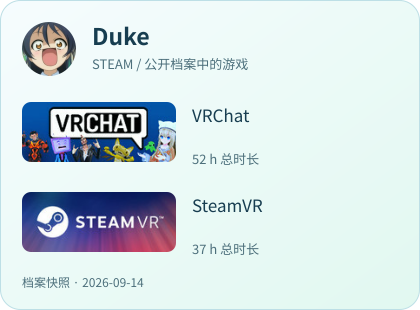</picture></a>

### A few favorites

<a href="https://anilist.co/anime/16417"><picture><source media="(prefers-color-scheme: dark)" srcset="./assets/anilist/favorite-0.dark.svg">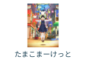</picture></a>
<a href="https://anilist.co/manga/100080"><picture><source media="(prefers-color-scheme: dark)" srcset="./assets/anilist/favorite-1.dark.svg">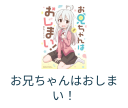</picture></a>

### Currently reading

<a href="https://anilist.co/manga/97700"><picture><source media="(prefers-color-scheme: dark)" srcset="./assets/anilist/reading-0.dark.svg">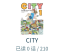</picture></a>
<a href="https://anilist.co/manga/100080"><picture><source media="(prefers-color-scheme: dark)" srcset="./assets/anilist/reading-1.dark.svg">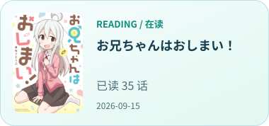</picture></a>

### Favorite characters

<a href="https://anilist.co/character/120800"><picture><source media="(prefers-color-scheme: dark)" srcset="./assets/anilist/character-0.dark.svg">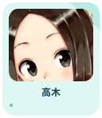</picture></a>
<a href="https://anilist.co/character/1743"><picture><source media="(prefers-color-scheme: dark)" srcset="./assets/anilist/character-1.dark.svg">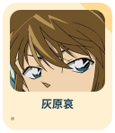</picture></a>
<a href="https://anilist.co/character/176754"><picture><source media="(prefers-color-scheme: dark)" srcset="./assets/anilist/character-2.dark.svg">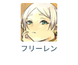</picture></a>
<a href="https://anilist.co/character/74850"><picture><source media="(prefers-color-scheme: dark)" srcset="./assets/anilist/character-3.dark.svg">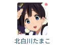</picture></a>
<a href="https://anilist.co/character/33221"><picture><source media="(prefers-color-scheme: dark)" srcset="./assets/anilist/character-4.dark.svg"></picture></a>
<a href="https://anilist.co/character/264094"><picture><source media="(prefers-color-scheme: dark)" srcset="./assets/anilist/character-5.dark.svg">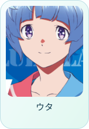</picture></a>
<a href="https://anilist.co/character/89641"><picture><source media="(prefers-color-scheme: dark)" srcset="./assets/anilist/character-6.dark.svg"></picture></a>
<a href="https://anilist.co/character/89576"><picture><source media="(prefers-color-scheme: dark)" srcset="./assets/anilist/character-7.dark.svg"></picture></a>
<a href="https://anilist.co/character/121514"><picture><source media="(prefers-color-scheme: dark)" srcset="./assets/anilist/character-8.dark.svg">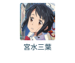</picture></a>
<a href="https://anilist.co/character/139710"><picture><source media="(prefers-color-scheme: dark)" srcset="./assets/anilist/character-9.dark.svg"></picture></a>

收藏与进度来自 [AniList](https://anilist.co/user/Duke486/)，保留原站排序。

## 03 / GitHub

<a href="https://github.com/Duke486"><picture><source media="(prefers-color-scheme: dark)" srcset="./assets/github/stats.dark.svg"></picture></a>
<a href="https://github.com/Duke486?tab=repositories"><picture><source media="(prefers-color-scheme: dark)" srcset="./assets/github/languages.dark.svg"></picture></a>

语言分布来自公开源码仓库，不代表熟练程度；延续原设置隐藏 Python。

---

最近成功更新：GitHub 2026-09-14 · AniList 2026-09-14 · Steam 2026-09-14。每日生成，数据以来源为准。

水蓝与薄荷之间，继续做喜欢的事。 · [素材来源与维护说明](./docs/MAINTENANCE.md)
